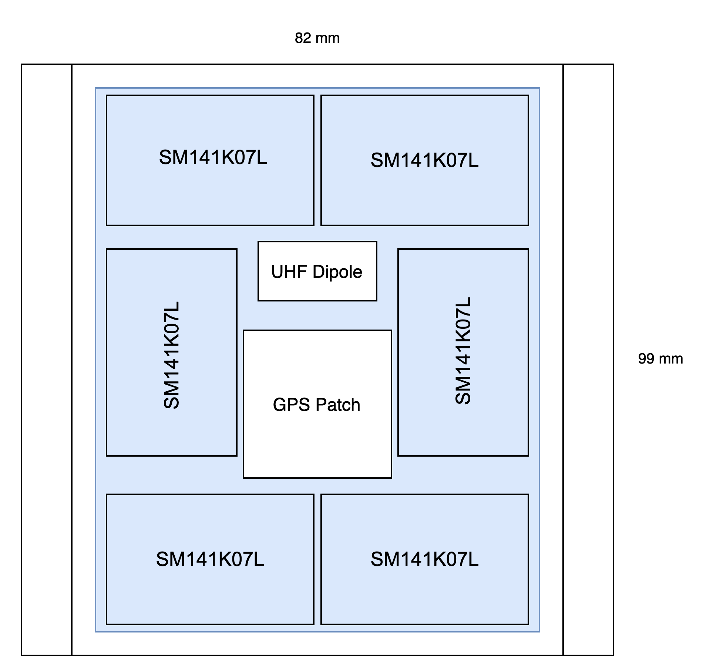
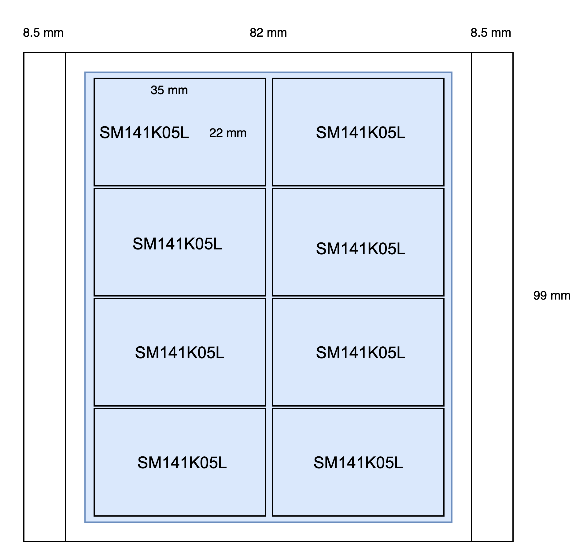
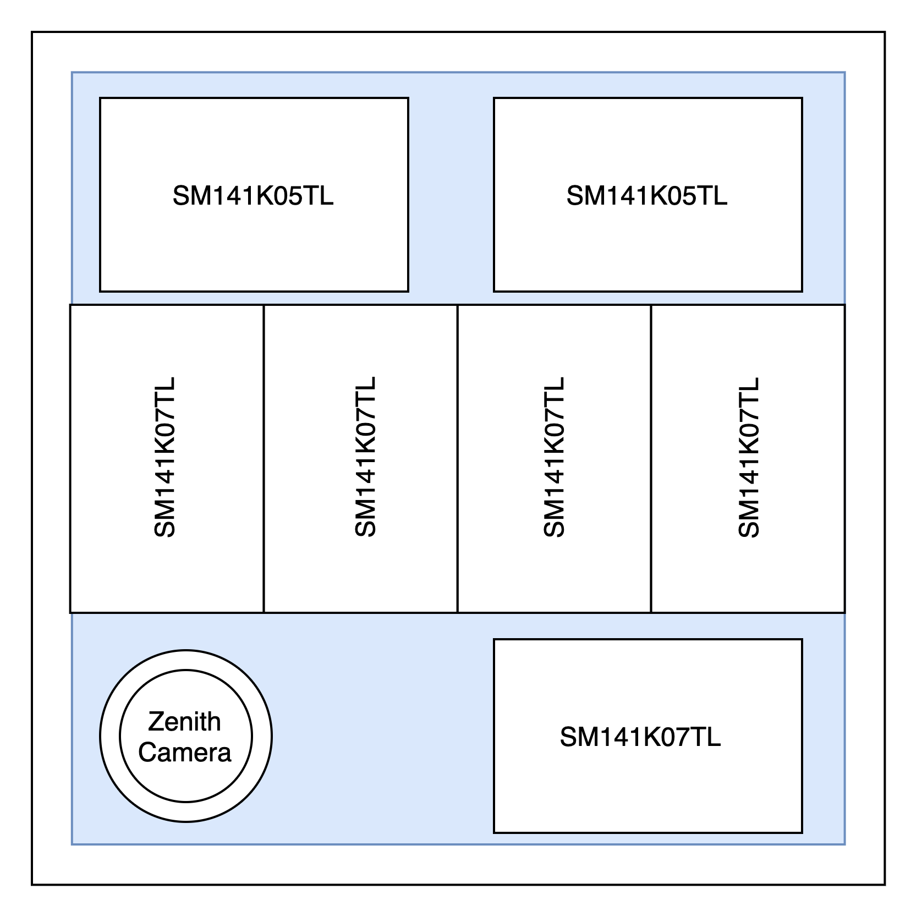
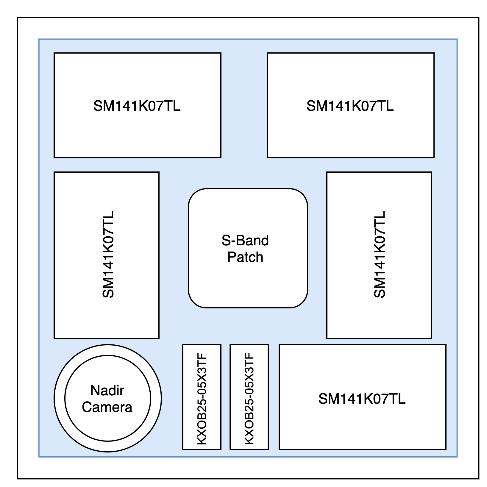
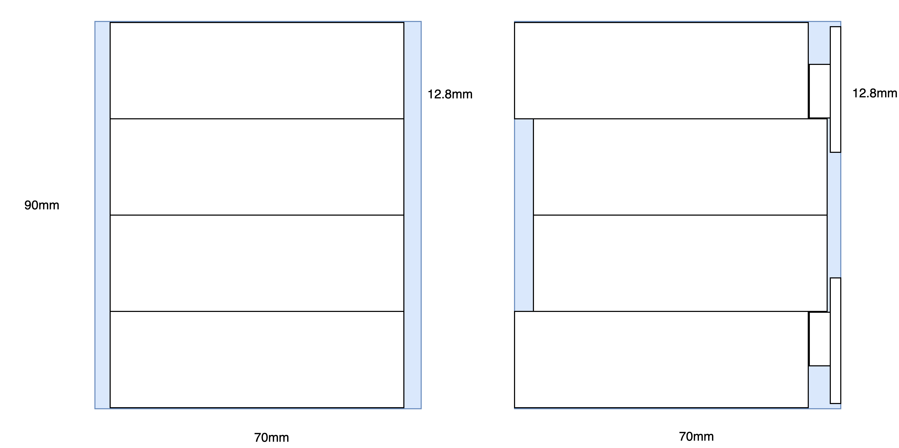

# Solar Panel Arrangement

Some of the panels may be inconsistent in thin vs. normal models, we are preliminary planning to use only the thin (denoted with "T" in the product number) solar panels.

[DigiKey BOM with components](https://www.digikey.com/BOM/Create/CreateSharedBom?bomId=864345)

## ±X

### Components

- Sun Sensor
- UHF Antenna: 1cm x 2cm
- GPS Antenna: (budgeted 2.5cm x 2.5cm)

### Solar Panels

- 6x SM141K07TL

### Characteristics

- V at Pmpp = 23.46V
- P at Pmpp = 0.924W

## ±Y

### Components

- Potentially some metal covering it, mounted inside the rails
- Sun Sensor

### Solar Panels

- 8x SM141K05TL

### Characteristics

- V at Pmpp = 22.3V
- P at Pmpp = 1.23W

## +Z

### Components

- Lens: 15mm diameter + margin
- Sun Sensor

### Solar Panels

- 5x SM141K07TL
- 2x SM141K05TL

### Characteristics

- V at Pmpp = 22.89V
- P at Pmpp = 1.08W

## -Z

### Components

- Lens: 18mm diameter + margin
- S-Band Antenna: 2.5cm x 2.5cm
- Sun Sensor

### Solar Panels

- 5x SM141K07TL
- 2x KXOB25-05X3TF

### Characteristics

- V at Pmpp = 22.89V
- P at Pmpp = 0.831W

## Deployables

### Components

- Mounting holes

### Solar Panels

- 4x SM141K10TL

### Characteristics

- V = 4 \_ 5.58V = 22.23V
- Pmpp = 4 \_ 0.307 = 1.128W

